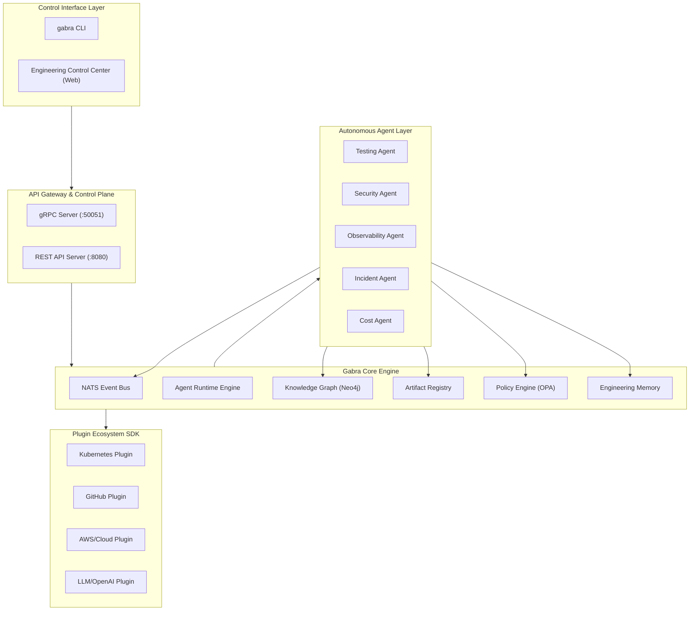
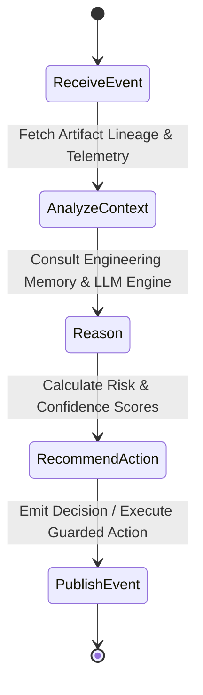
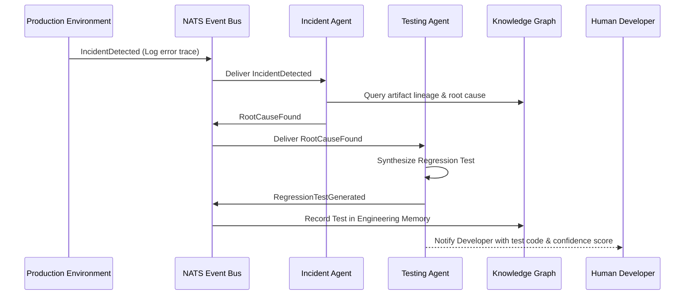
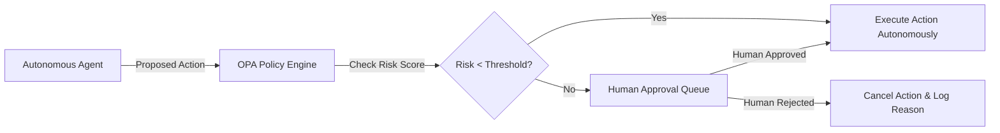

# GabraOS — Architecture Specification

This document provides the architectural specification for **GabraOS**, the Autonomous Engineering Operating System. 

---

## 1. Overall System Architecture

GabraOS consists of five primary layers:
1. **Control Interface**: Web Control Center & CLI (`gabra`).
2. **Autonomous Agent Runtime**: Event-driven AI agents (Testing, Security, Observability, Incident, Cost).
3. **Core Platform Engine**: Event Bus (NATS), Knowledge Graph (Neo4j), Artifact Store, Policy Engine (OPA), Engineering Memory.
4. **Integration & Plugin SDK**: Ecosystem connectors (Kubernetes, GitHub, AWS, OpenAI, etc.).
5. **Target Infrastructure & Observability**: OpenTelemetry, Prometheus, Loki, Cloud infrastructure.



---

## 2. Agent Architecture

Every autonomous agent in GabraOS executes a standardized 5-phase loop:



### Agent Lifecycle
1. **Receive Event**: Agent subscribes to relevant events on the NATS event bus.
2. **Analyze Context**: Queries the Knowledge Graph to extract lineage, dependencies, past incidents, and artifact states.
3. **Reason**: Synthesizes conclusions using AI models combined with historical patterns stored in Engineering Memory.
4. **Recommend Action**: Evaluates risk against OPA policies and decides whether to execute autonomously or request human approval.
5. **Publish Event**: Emits outcome events (e.g., `RegressionTestGenerated`, `DeploymentRolledBack`) to update system state.

---

## 3. Event-Driven Architecture

GabraOS uses an asynchronous event bus (NATS / internal pub-sub) for decoupled agent communication. Agents do not call each other directly; they subscribe to and publish events.



---

## 4. Security & Guardrail Architecture

Security and safety operate via Open Policy Agent (OPA) integration:



---

## 5. Data Flow Architecture

```text
[Telemetry / Git Webhook / Incident]
               │
               ▼
       [NATS Event Bus]
               │
      ┌────────┴────────┐
      ▼                 ▼
[Artifact Store]   [Knowledge Graph]
      │                 │
      └────────┬────────┘
               ▼
     [Agent Runtime Engine]
               │
        (Reason & Test)
               │
               ▼
 [Engineering Memory & UI Console]
```

---

*GabraOS Architecture Specifications*
